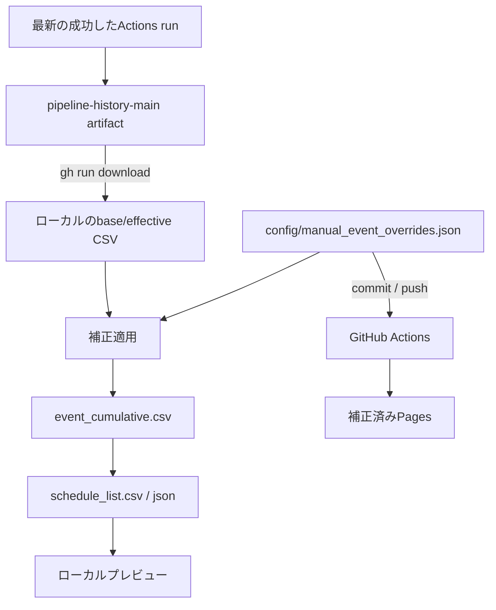

# ローカル公演メンテナンス画面 実装計画

## 1. 目的

GitHub Actions が生成した最新の公演データをこの端末へ取得し、ブラウザ上で公演内容を手動補正できるようにする。
補正内容は生成CSVを直接書き換えるのではなく、リポジトリで永続管理する補正JSONへ保存し、ローカル再生成と次回GitHub Actionsの両方で必ず再適用する。

この文書は別の実装担当モデルへの引き継ぎ仕様である。曖昧な箇所を独自判断で大きく拡張せず、まず以下のMVPを完成させること。

## 2. 重要な前提

- GitHub Pages は静的配信なので、Pages上の画面からリポジトリ内ファイルへ直接保存しない。
- メンテナンス画面はローカル専用とし、`127.0.0.1` にだけバインドするPython HTTPサーバーから配信する。
- メンテナンス画面のHTML・CSS・JSは `web/` 配下へ置かない。`src/sync_web_to_docs.py` は `web/` 直下のファイルを `docs/` へコピーするため、そこへ置くと管理画面がGitHub Pagesへ公開される。
- `data/output/event_cumulative.csv` や `docs/data/schedule_list.json` は生成物であり、手動修正の保存先にしない。次回パイプラインで上書きされる。
- 永続化するのは、新設する `config/manual_event_overrides.json` だけとする。
- 最新の詳細データはGitリポジトリではなく、GitHub Actionsの `pipeline-history-main` artifactから取得する。
- GitHubトークンをブラウザへ渡さない。認証は、この端末で認証済みのGitHub CLI `gh` に任せる。
- Python依存パッケージは増やさず、標準ライブラリと既存コードだけで実装する。サーバーには `http.server.ThreadingHTTPServer` を使用してよい。

## 3. 現在の生成経路

現在の主要な経路は次のとおり。

1. `structured_events_filtered_cumulative.csv`
2. `src/build_event_cumulative.py`
3. `data/output/event_cumulative.csv`
4. `src/build_schedule_list.py`
5. `data/output/schedule_list.json` と `docs/data/schedule_list.json`
6. `.github/workflows/daily-pipeline.yml` が `docs/` をPages artifactとして配備

`event_cumulative.csv` は34列あり、`event_id`、公演名、団体、会場、地域、開始日、終了日、開始時刻、公開判定用フラグ、元ツイート情報などを持つ。

現在の `event_id` は主に `normalized_event_name` のslugから生成される。完全に恒久的なIDではないため、補正対象は `event_id` だけでなく元ツイートURLも保持し、IDが変化した場合のフォールバック照合に使う。

## 4. 完成後の処理フロー



### 典型的な利用手順

1. ローカルサーバーを起動する。
2. ブラウザでメンテナンス画面を開く。
3. 「GitHubから最新データ取得」を押す。
4. 公演を検索して内容を修正し、補正を保存する。
5. ローカルプレビューで表示を確認する。
6. 「補正をGitHubへ反映」を押すか、手動で補正JSONをcommit/pushする。
7. pushで既存Actionsが起動し、補正済みデータをPagesへ配備する。

## 5. 永続補正データの設計

### 5.1 新規ファイル

`config/manual_event_overrides.json` を作成し、初期値を次のようにする。

```json
{
  "version": 1,
  "overrides": []
}
```

CSVではなくJSONを使う理由は、次を区別するためである。

- `set` にキーがない: 元の値を維持する。
- `set` に空文字がある: 元の値を明示的に消す。
- booleanや公開状態を文字列の曖昧さなしに保持する。

### 5.2 1件の補正レコード

```json
{
  "target_event_id": "event-example",
  "target_source_tweet_urls": [
    "https://x.com/example/status/123"
  ],
  "set": {
    "event_name": "正式な公演名",
    "normalized_event_name": "正式な公演名",
    "organization": "正式な劇団名",
    "venue_name": "正式な会場名",
    "normalized_venue_name": "正式な会場名",
    "location": "石川県金沢市…",
    "normalized_location": "石川県金沢市… / 石川県",
    "start_date": "2026-08-01",
    "end_date": "2026-08-03",
    "start_time": "19:00",
    "category": "演劇公演",
    "posting_recommendation": "post",
    "is_event_announcement": "true",
    "has_actionable_schedule_info": "true",
    "manual_reference_url": "https://example.com/performance",
    "manual_publish_status": "published"
  },
  "note": "公式サイトで確認",
  "updated_at": "2026-07-11T12:34:56+09:00"
}
```

### 5.3 編集を許可するフィールド

MVPでは任意フィールドの書き換えを許可せず、以下をallowlistにする。

- `event_name`
- `normalized_event_name`
- `organization`
- `venue_name`
- `normalized_venue_name`
- `location`
- `normalized_location`
- `start_date`
- `end_date`
- `start_time`
- `category`
- `posting_recommendation`
- `is_event_announcement`
- `has_actionable_schedule_info`
- `manual_reference_url`
- `manual_publish_status`

`event_id`、`event_key`、元ツイート情報、初出・最終確認日時は編集不可とする。

### 5.4 公開状態

`manual_publish_status` は次の3値だけを許可する。

- `default`: 現在の自動判定に従う。
- `published`: 人が公開対象と確定する。最低限、有効な開始日と表示可能な公演名または団体名は必要。
- `excluded`: 人が非公開と確定する。scheduleとX自動投稿の両方から除外する。

`published` は既存の演劇シグナル等の自動判定を上書きするが、カレンダーとして成立しない不正な日付は許可しない。

### 5.5 対象照合

補正の適用順は次のとおり。

1. `target_event_id` が一致するレコードを探す。
2. 見つからなければ、レコードの `tweet_url` または `source_tweet_urls` と `target_source_tweet_urls` の積集合で探す。
3. フォールバック候補が1件なら適用する。
4. 0件ならorphanとして適用せず、画面に警告する。
5. 2件以上ならambiguousとして適用せず、画面に警告する。

補正後に `event_id` と `event_key` を再生成しない。人が見ていた対象との対応を維持するためである。

## 6. baseデータとeffectiveデータを分離する

既に補正された `event_cumulative.csv` へ補正を重ねるだけでは、補正の削除時に元の値へ戻せない。そのため次の2ファイルを持つ。

- `data/output/event_cumulative_base.csv`: 自動抽出・統合済み、手動補正適用前。
- `data/output/event_cumulative.csv`: baseへ手動補正を適用した公開用effectiveデータ。

### `src/build_event_cumulative.py` の変更

1. `--base-output-csv` を追加し、既定値を `data/output/event_cumulative_base.csv` にする。
2. `--manual-overrides-json` を追加し、既定値を `config/manual_event_overrides.json` にする。
3. 現在の処理を `merge_records_by_event_id()` まで実行する。
4. その時点のレコードをbase CSVへ書く。
5. 新しい純粋関数 `apply_manual_event_overrides()` を呼ぶ。
6. 補正済みレコードを従来の `event_cumulative.csv` へ書く。
7. 適用件数、orphan件数、ambiguous件数を標準出力へ出す。

### 出力フィールド追加

`OUTPUT_FIELDS` に以下を追加する。

- `manual_reference_url`
- `manual_publish_status`
- `manual_override_updated_at`

base側では空文字、effective側では適用値を入れる。

## 7. 補正適用モジュール

新規に `src/manual_event_overrides.py` を作る。

最低限、次の純粋関数とI/O関数へ分ける。

- `load_manual_event_overrides(path)`
- `validate_manual_event_overrides(payload)`
- `apply_manual_event_overrides(records, overrides)`
- `upsert_manual_event_override(payload, override)`
- `delete_manual_event_override(payload, target_event_id)`
- `write_manual_event_overrides(path, payload)`
- `split_source_tweet_urls(record)`

### バリデーション

- JSONトップレベルの `version` は `1`。
- `overrides` は配列。
- `target_event_id` は必須。
- `set` はobject。
- `set` 内にallowlist外のキーがあればエラー。
- `start_date` と `end_date` は空文字または `YYYY-MM-DD`。
- `start_time` は空文字または `HH:MM`。
- 両方の日付がある場合、`end_date >= start_date`。
- URLは空文字または `http://` / `https://`。
- `posting_recommendation` は空文字、`post`、`review`、`skip`。
- boolean系CSV値は空文字、`true`、`false`。
- `manual_publish_status` は `default`、`published`、`excluded`。
- 同じ `target_event_id` の補正は1件だけ。

保存には既存の `atomic_write_text()` を使い、UTF-8、末尾改行あり、`ensure_ascii=False`、インデント2で安定したJSONを出力する。

## 8. 公開判定と参照URLの変更

### `src/event_candidate_rules.py`

`is_schedule_eligible_event()` の先頭付近に手動公開状態を扱う処理を追加する。

- `excluded` なら即座に `False`。
- `published` なら、開始日が有効で、公演名または団体名があることを確認して `True`。
- `default` または空なら従来ロジックをそのまま使う。

この関数はschedule掲載とX新規投稿の両方から使われているため、両者の判定が揃う。

### `src/build_schedule_list.py`

`choose_reference_url()` の最優先で `manual_reference_url` を見る。値があれば次を返す。

- URL: `manual_reference_url`
- 種別: `manual_reference_url`

その後は現在の団体公式サイト、団体公式X、会場公式サイト、投稿者Xの順序を維持する。

### スキーマ文書

`web/SCHEMA.md` に以下を追記する。

- `official_reference_type` に `manual_reference_url` が入り得る。
- 手動公開状態がschedule生成前に適用される。

公開JSONの既存フィールドは削除・改名しない。

## 9. GitHub Actions artifactの変更

`.github/workflows/daily-pipeline.yml` のdurable history snapshot対象へ `data/output/event_cumulative_base.csv` を追加する。

既存artifactの外側はActionsが作るzipで、その中に `pipeline_history_snapshot.zip` があり、さらにその中に `data/output/...` が入る構造である。新しいbase CSVも内側のsnapshotへ含める。

キャッシュへのbase追加は必須ではない。毎回 `build_event_cumulative.py` が再生成するためである。artifactへの追加はローカルメンテナンスで元値へ戻すため必須。

既存artifactにはbase CSVがないため、ローカル同期処理は移行期間だけ次のフォールバックを許す。

- baseがあればそれを使う。
- baseがなければ取得した `event_cumulative.csv` をbaseとしてコピーし、「旧artifactのため補正解除時に元値へ戻らない可能性がある」と警告する。

新しいworkflowが一度成功した後はbaseが存在することを正常条件とする。

## 10. GitHubから最新データを取得するモジュール

新規に `src/github_artifact_sync.py` を作る。

### 前提確認

- `gh --version` が成功すること。
- `gh auth status` が成功すること。
- カレントディレクトリを必ずリポジトリルートにすること。
- シェル文字列を組み立てず、`subprocess.run([...], shell=False)` を使うこと。

### 最新成功runの取得

GitHub CLIの現在の仕様に合わせ、概念的に次の引数配列を使う。

```text
[
  "gh", "run", "list",
  "--workflow", "daily-pipeline.yml",
  "--branch", "main",
  "--status", "success",
  "--limit", "1",
  "--json", "databaseId,createdAt,updatedAt,headSha,url"
]
```

`--jq` へ依存せず、返されたJSON配列をPythonで解析する。0件なら明示的なエラーにする。

### artifactのダウンロード

取得したrun IDを指定して次の引数配列を使う。

```text
[
  "gh", "run", "download", "<run-id>",
  "--name", "pipeline-history-main",
  "--dir", "<temporary-directory>"
]
```

run IDを必ず指定する。単に最新artifactを取る動作へ依存しない。

### 安全な展開と反映

1. `tempfile.TemporaryDirectory()` にダウンロードする。
2. 展開された `pipeline_history_snapshot.zip` が存在することを確認する。
3. zip内のメンバーを列挙し、絶対パス、`..`、想定外パスを拒否する。
4. allowlistは以下とする。
   - `data/output/posted_events.csv`
   - `data/output/structured_events_cumulative.csv`
   - `data/output/structured_events_filtered_cumulative.csv`
   - `data/output/event_cumulative_base.csv`
   - `data/output/event_cumulative.csv`
5. 別の一時ディレクトリへ展開する。
6. CSVとして読めることとヘッダーが存在することを確認する。
7. `atomic_open()` でローカルの各ファイルを差し替える。
8. 同期したrun ID、head SHA、作成日時、URLを `data/output/_tmp/maintenance_sync_state.json` に保存する。
9. 同期後、ローカルの補正JSONをbaseへ再適用してeffective CSVとscheduleを再生成する。

同期前に画面上の未保存変更がある場合は、フロント側で同期を禁止する。

## 11. ローカル再生成処理

新規に `src/rebuild_maintained_outputs.py` を作るか、同等の再利用可能な関数を用意する。

処理内容は以下だけとし、X APIやGitHub Modelsを呼ばない。

1. `event_cumulative_base.csv` を読む。
2. `manual_event_overrides.json` を検証して適用する。
3. `event_cumulative.csv` をatomic writeする。
4. `build_schedule_list.py` の関数を直接利用して次を再生成する。
   - `data/output/schedule_list.csv`
   - `data/output/schedule_list.json`
5. ローカルメンテ画面のプレビューは `data/output/schedule_list.json` を読む。
6. `docs/data/schedule_list.json` はローカル保存時に書き換えない。GitHub Actionsが正式配備時に生成する。

`run_pipeline.py` 全体を呼ばないこと。全体実行はX収集やLLM抽出を伴い、メンテ保存処理として重すぎる。

## 12. ローカルHTTPサーバー

新規に `src/maintenance_server.py` を作る。

### 起動仕様

- 既定host: `127.0.0.1`
- 既定port: `8765`
- `--host` はMVPでは提供しないか、`127.0.0.1` のみ許可する。
- 起動後に既定ブラウザでトップページを開く。`--no-browser` も用意する。
- 静的ファイルは新設する `maintenance_web/` ディレクトリから配信する。
- リポジトリ外のパスは一切配信しない。

### API

- `GET /api/status`
  - gh利用可否、認証状態
  - 最新同期run情報
  - base/effective件数
  - 補正件数、orphan件数、ambiguous件数
  - Gitブランチ、originとの差分状態
- `POST /api/sync`
  - 最新成功runのartifactを取得し、再生成する。
- `GET /api/events`
  - effectiveイベント一覧と、base値、補正有無を返す。
  - `q`、`publication`、`prefecture` 程度のサーバー側フィルターを許可する。
- `GET /api/events/<event-id>`
  - base、effective、現在のoverride、元ツイートURLを返す。
- `PUT /api/events/<event-id>/override`
  - 補正を検証してupsertし、再生成する。
- `DELETE /api/events/<event-id>/override`
  - 補正を削除し、baseから再生成する。
- `GET /api/schedule`
  - ローカル生成したschedule JSONを返す。
- `POST /api/publish`
  - 補正JSONだけをcommit/pushする。後述の安全条件を満たさなければ拒否する。

すべての成功・失敗レスポンスはJSONとし、例外のスタックトレースや端末の絶対パスをブラウザへ返さない。

### API保存時の競合検出

`GET` 時に補正JSON内容のSHA-256をrevisionとして返す。`PUT` と `DELETE` はクライアントが送ったrevisionと現在値を比較し、不一致ならHTTP 409にする。これにより複数タブの上書きを防ぐ。

### ローカルサーバーの安全対策

- `Host` は `127.0.0.1:<port>` または `localhost:<port>` だけ許可する。
- 更新系APIは `Origin` が同一originであることを確認する。
- CORSヘッダーを付けない。
- bind先はloopbackだけにする。
- 任意コマンド、任意ファイルパス、任意Git引数をAPI入力から受け取らない。
- ディレクトリ一覧を返さない。
- JSON bodyにはサイズ上限を設ける。

## 13. ローカル画面

新規ディレクトリ `maintenance_web/` に次を作る。

- `index.html`
- `maintenance.js`
- `maintenance.css`

既存公開画面と雰囲気を合わせてもよいが、`web/` からの相対参照には依存しない。

### MVP画面構成

#### 上部ステータス

- 最終同期日時
- 対象Actions runへのリンク
- 取得データ件数
- 補正件数
- orphan / ambiguous警告
- 「GitHubから最新データ取得」ボタン
- 「補正をGitHubへ反映」ボタン

#### 左側: 公演一覧

- キーワード検索
- 都道府県
- 開催前 / 全件
- 公開状態 `default` / `published` / `excluded`
- 補正ありのみ
- 公演名、団体、会場、日程、補正状態を表示

#### 右側: 編集フォーム

- 公演名
- 団体名
- 会場名
- 所在地、正規化所在地
- 開始日、終了日、開始時刻
- カテゴリ
- 公式参照URL
- 公開状態
- 補正メモ
- 元ツイートを別タブで開くリンク
- base値との差分表示
- 「補正を保存」
- 「補正を解除して自動抽出値へ戻す」

#### プレビュー

- 保存後のschedule掲載有無
- scheduleに出る公演名、団体、会場、日程、参照URL
- 除外理由または自動判定結果

未保存のフォーム変更がある状態では、別公演選択、同期、画面離脱の前に確認を出す。

## 14. GitHubへの反映

MVPで `POST /api/publish` を実装する場合、事故防止のため次を必須にする。

1. 現在ブランチが `main` である。
2. `git fetch origin main` が成功する。
3. ローカルHEADが `origin/main` よりbehindでない。behindなら自動pull/rebaseせず拒否する。
4. 補正JSONに差分がある。
5. commit対象は `config/manual_event_overrides.json` だけに限定する。
6. 他のstaged/unstaged変更をcommitへ混ぜない。
7. 固定プレフィックスを持つcommit messageを使用する。
8. pushに失敗した場合、勝手にforce pushしない。

push後は `.github/workflows/daily-pipeline.yml` の既存 `config/**` push条件でActionsが起動する。workflow権限の追加は不要。

自動commit/pushの安全な実装に時間がかかる場合は、MVPの第一段階ではボタンを無効にし、補正JSONの保存と手動commit/push手順まででよい。ただし最新artifact取得、編集、永続補正、ローカルプレビューは必須。

## 15. 既存ファイルの変更一覧

### 必須変更

- `src/build_event_cumulative.py`
  - base出力、補正JSON引数、補正適用、追加フィールド。
- `src/event_candidate_rules.py`
  - `manual_publish_status` の扱い。
- `src/build_schedule_list.py`
  - `manual_reference_url` の優先。
- `src/run_pipeline.py`
  - 必要ならbase/overrideパスを明示。既定値で動くなら変更は最小限でよい。
- `.github/workflows/daily-pipeline.yml`
  - durable artifactへbase CSVを追加。
- `web/SCHEMA.md`
  - 手動参照URL種別と公開判定の説明。
- `README.md`
  - 前提、起動、同期、編集、push、トラブルシュート。

### 新規ファイル

- `config/manual_event_overrides.json`
- `src/manual_event_overrides.py`
- `src/github_artifact_sync.py`
- `src/rebuild_maintained_outputs.py`
- `src/maintenance_server.py`
- `maintenance_web/index.html`
- `maintenance_web/maintenance.js`
- `maintenance_web/maintenance.css`
- 対応するpytestファイル

### 変更しない方針

- `docs/` 配下の生成済みHTML/JSへメンテ画面を追加しない。
- `docs/data/schedule_list.json` をメンテ保存時に直接編集しない。
- `data/bootstrap/structured_events_cumulative_seed.csv` を公演単位補正の保存先にしない。
- `config/event_aliases.csv` は重複イベントの手動マージ専用として維持する。
- 団体・会場マスター編集は初回MVPへ含めない。公演補正が安定した後の第2段階とする。

## 16. テスト計画

### `tests/test_manual_event_overrides.py`

- event_id一致で指定フィールドだけ上書きされる。
- `set` にないフィールドは保持される。
- 空文字による明示クリアができる。
- 元ツイートURLでフォールバックできる。
- 0件はorphanになる。
- 複数候補はambiguousになり適用されない。
- allowlist外フィールドを拒否する。
- 不正日付・時刻・URL・公開状態を拒否する。
- end_dateがstart_dateより前なら拒否する。
- JSON保存がatomicで、失敗時に元ファイルが残る。
- 日本語がUnicode escapeだらけにならない。
- 補正削除後にbase値へ戻る。

### `tests/test_build_event_cumulative.py` への追加

- base CSVには補正前値が入る。
- effective CSVには補正後値が入る。
- `event_id` は補正後も変わらない。
- `manual_reference_url` と `manual_publish_status` が出力される。

### `tests/test_event_candidate_rules.py` への追加

- `excluded` は従来条件を満たしても非掲載。
- `published` は演劇シグナル不足でも最低構造条件を満たせば掲載。
- `published` でも日付不正なら非掲載。
- `default` は既存挙動を変えない。

### `tests/test_build_schedule_list.py` 相当

既存の関連テストへ追加するか新設する。

- 手動参照URLがマスターURLより優先される。
- reference typeが `manual_reference_url` になる。
- excludedがscheduleに出ない。

### `tests/test_github_artifact_sync.py`

`subprocess.run` をmockし、実GitHubへ接続しない。

- 最新成功runのJSONを正しく解釈する。
- run 0件、gh未導入、未認証を明確にエラーにする。
- 指定run IDとartifact名でdownloadする。
- 二重zipを正しく扱う。
- zip slipを拒否する。
- 想定外ファイルを無視または拒否する。
- baseなし旧artifactのフォールバック警告。
- 検証失敗時に既存ローカルデータを壊さない。

### `tests/test_maintenance_server.py`

一時ディレクトリへデータを作り、実リポジトリを変更しない。

- イベント一覧・詳細取得。
- override保存・削除。
- revision不一致で409。
- 不正JSONで400。
- allowlist外Host/Originを拒否。
- パストラバーサルを拒否。
- APIエラーに絶対パスやstack traceを含めない。

### 回帰確認

- `python -m pytest tests/ -q` が全件成功する。
- 補正JSONが空のとき、従来のschedule内容が変わらない。
- `src/sync_web_to_docs.py` 実行後もメンテ画面が `docs/` へコピーされない。
- 既存のローカルプレビュー、Pages配備、X投稿候補判定を壊さない。

## 17. 実装順序

1. 補正JSONスキーマと `manual_event_overrides.py` を実装し、単体テストを通す。
2. `build_event_cumulative.py` をbase/effective二層にし、既存テストと追加テストを通す。
3. `manual_publish_status` と `manual_reference_url` をschedule生成へ反映し、テストを通す。
4. workflow artifactへbase CSVを追加する。
5. ローカル再生成モジュールを実装する。
6. GitHub artifact同期モジュールを実装し、mockテストを通す。
7. ローカルHTTP APIを実装する。
8. メンテナンス画面を実装する。
9. 必要なら安全なcommit/push機能を実装する。
10. READMEとスキーマ文書を更新する。
11. 全pytestを実行する。
12. ローカルサーバーを実際に起動し、ブラウザで同期・編集・解除・プレビューを確認する。
13. Actionsを手動実行または補正JSONをpushし、新artifactにbase CSVが含まれ、Pagesへ補正が反映されることを確認する。

## 18. 受け入れ条件

以下をすべて満たしたらMVP完了とする。

- ローカルサーバーが `127.0.0.1` だけで起動する。
- 認証済みGitHub CLIを使い、最新の成功runの `pipeline-history-main` を取得できる。
- ブラウザへGitHub認証情報を渡さない。
- 公演名、団体、会場、地域、日付、時刻、参照URL、公開状態を編集できる。
- 補正が `config/manual_event_overrides.json` へatomicに保存される。
- 補正解除でbase値へ戻る。
- 保存後のscheduleをローカルで即座にプレビューできる。
- 次回パイプラインでも同じ補正が再適用される。
- `excluded` がscheduleとX自動投稿の両方から除外される。
- `published` が最低構造条件の範囲で自動判定を上書きできる。
- 手動参照URLが公開scheduleで最優先になる。
- orphan / ambiguous補正が黙って誤適用されず、画面に表示される。
- 管理画面のファイルがGitHub Pages artifactへ入らない。
- 既存テストと新規テストがすべて成功する。

## 19. 実装担当モデルへの追加指示

- 実装前にこの計画と、対象となる既存ファイルを最後まで読むこと。
- 生成物を直接修正するだけの実装にしないこと。
- 既存公開JSONの互換性を壊さないこと。
- 変更範囲をMVPへ絞り、団体・会場マスター編集は後回しにすること。
- すべての外部コマンドは引数配列＋`shell=False` で実行すること。
- ファイル更新には既存のatomic I/Oを利用すること。
- テストでは実GitHub、X API、GitHub Models、実ユーザーファイルへ触れないこと。
- 実装完了時は、変更ファイル、起動方法、確認したテスト、未実装事項を報告すること。
